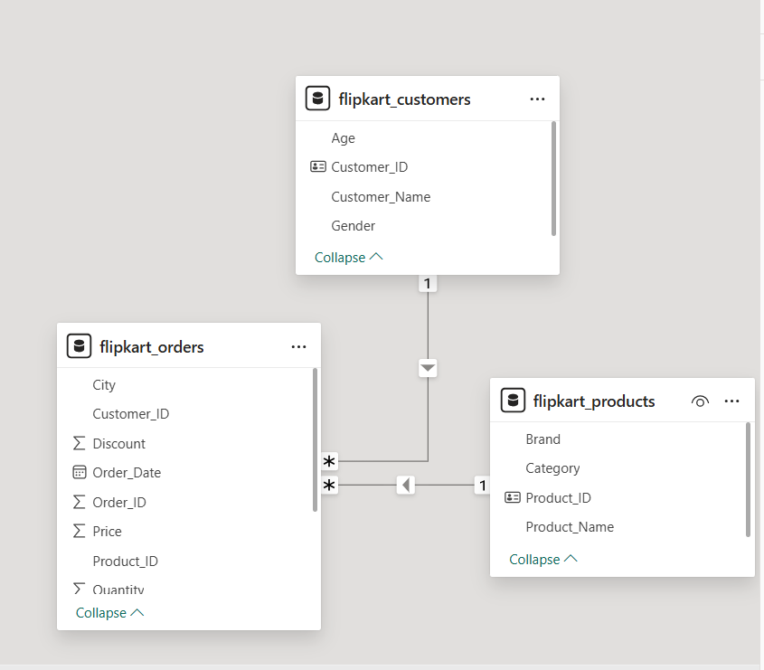

# Flipkart Sales Analysis Project

## Project Overview
This project focuses on analyzing Flipkart sales data to generate meaningful business insights. The analysis was performed using SQL, Python, Excel, and Power BI. The goal of this project is to clean messy data, perform exploratory data analysis, and build an interactive dashboard for better decision-making.

## Tools & Technologies Used
* Excel – Initial data exploration
* Python – Data cleaning and preprocessing
* SQL – Data analysis and business queries
* Power BI – Data modeling and dashboard visualization

## Project Workflow
1. Raw sales data was collected in CSV format.
2. Data was cleaned and preprocessed using Python.
3. Business analysis queries were performed using SQL.
4. Data modeling and dashboard creation were done in Power BI.
5. Insights were summarized and documented in a PDF report.

## Dataset Description
The dataset includes Flipkart sales related information such as:

* Customer details
* Product details
* Order information
* Quantity purchased
* Discount offered
* Total sales amount

## Key Business Insights
* Electronics category generated the highest sales.
* Certain cities showed higher purchasing behavior.
* Discount strategies impacted product sales.
* Purchase patterns were analyzed based on gender.

## Project Structure
flipkart-sales-analysis

data
Contains raw and cleaned CSV datasets used for analysis.

notebooks
Python notebook used for data cleaning and exploratory analysis.

powerbi_dashboard
Power BI dashboard file used for visualization and reporting.

reports
PDF document containing summarized business insights.

images
Screenshots of dashboard and data model used in the project.

README.md
Project documentation and overview.

## Dashboard Preview

## Data Model

## Conclusion

This project demonstrates an end-to-end data analytics workflow including data cleaning, analysis, visualization, and insight generation using multiple tools.
* Discount strategies impacted product sales.
* Purchas
